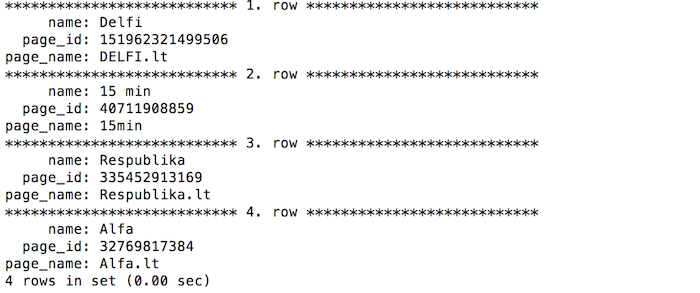
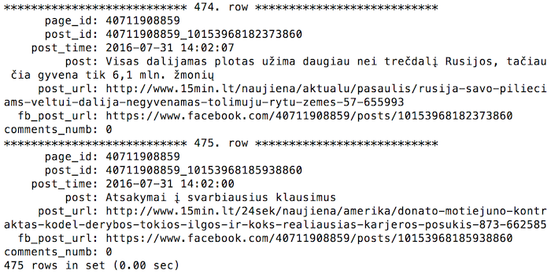

# LT-news-crawler
Get posts and comments from Facebook.com pages and store them into MySQL DB. It is based on Python3.
##Introduction
	- Create Facebook developer account
	- Install required modules pip install -r requirements.txt
	- Modify _config.yaml into config.yaml and fill in with your settings
	- You can create tables according my template using sql_tables.sql
	- Start having fun!
##Examples

